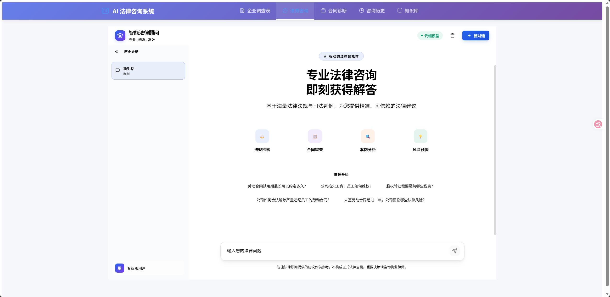
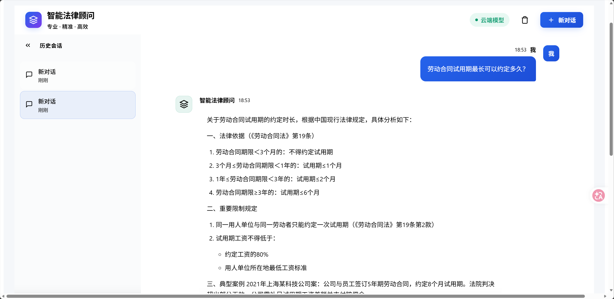
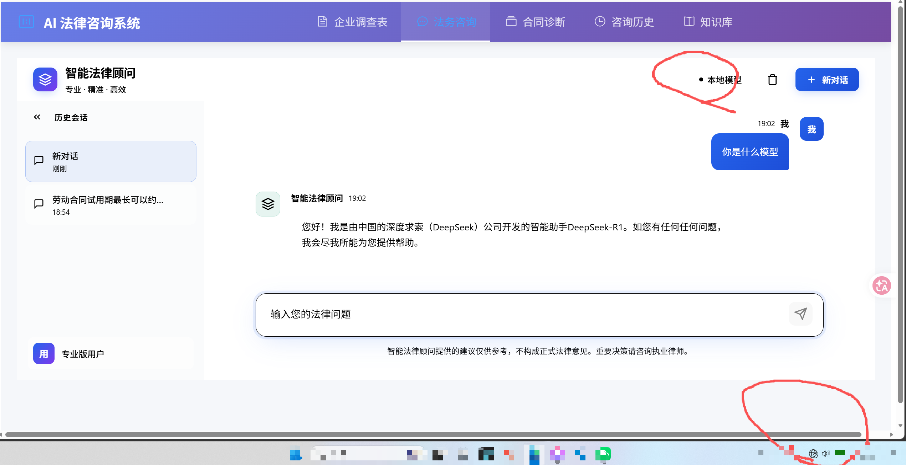
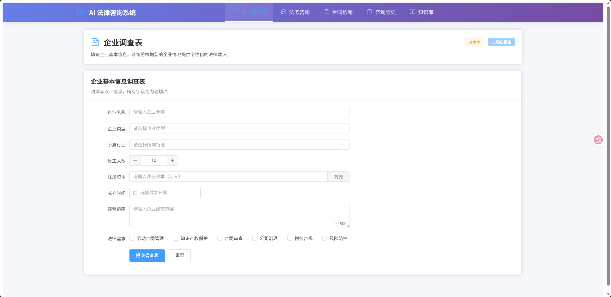
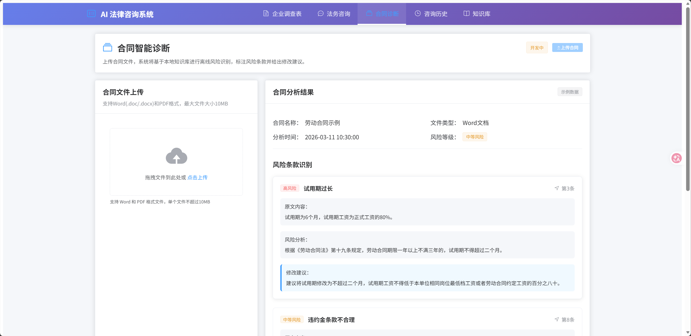
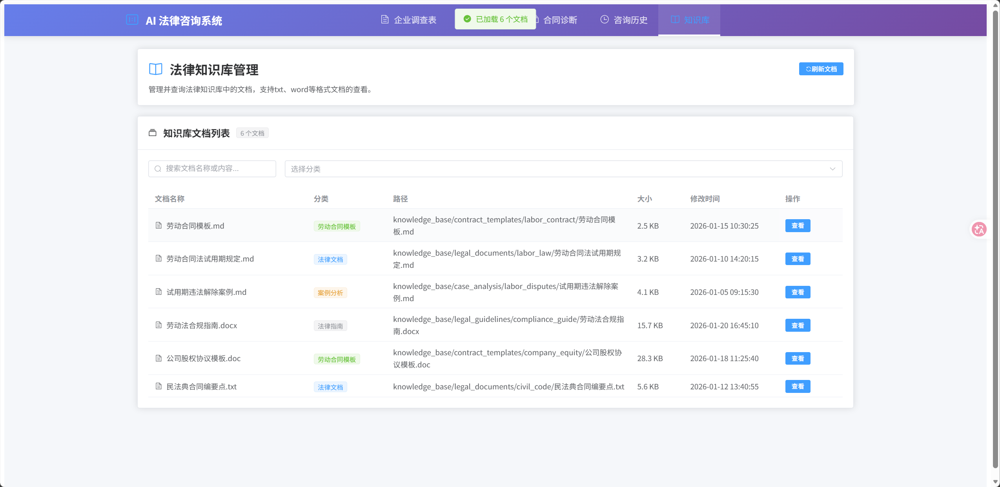
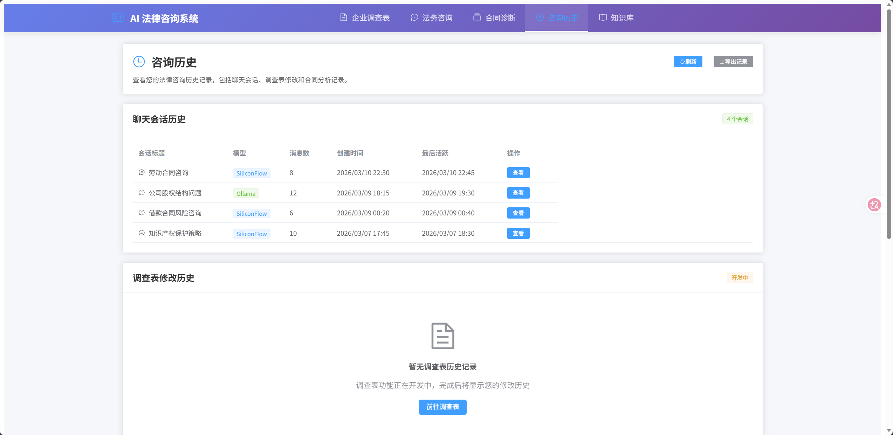

# 📋 AI 法律咨询系统

基于FastAPI + Vue3 + PostgreSQL构建的AI法律咨询系统。

## 🎯 项目概述

**AI 法律咨询系统**是一个面向企业的智能法律服务平台，通过 AI 大模型技术结合专业法律知识库，为企业提供实时法律咨询、个性化调查、合同风险诊断一站式法律服务。系统采用前后端分离架构，支持云端与本地 AI 模型，确保数据安全与响应效率。

### 技术栈

- **后端**: FastAPI + SQLAlchemy + PostgreSQL
- **前端**: Vue3 + TypeScript + Element Plus + Pinia + Vue Router
- **AI模型**: SiliconFlow（云端）、Ollama（本地）
- **数据库**: PostgreSQL
- **部署**: Docker（计划中）

## 🏗️ 第一阶段：法务咨询聊天功能（已完成）

### 功能描述
- 主页为法务咨询聊天界面



- 支持多轮对话，可切换LLM提供商（SiliconFlow/Ollama）

| 多轮对话示例 | 模型切换界面 |
|--------------|--------------|
|  |  |

- 对话历史保存在数据库
- 支持清空对话、重新生成回答

### 数据库表
- `chat_sessions` 法务咨询聊天会话 id, title, model_provider, created_at, updated_at
- `chat_messages` 聊天消息记录 id, session_id, role(user/assistant), content, created_at

## ⏳ 第二阶段：企业调查表功能（开发中）



### 功能描述
- 固定选项的调查表单（单选/多选/填空混合）
- 用户填写/修改企业信息后保存
- **关键逻辑**：任何字段修改 → 触发LLM分析变更 → 生成针对性法律建议
- 支持查看历史修改记录和建议
- RAG增强：法务咨询聊天时，LLM自动结合最新调查表内容+历史聊天记录综合回答，实现个性化法律咨询

## ⏳ 第三阶段：合同智能诊断功能（开发中）



### 功能描述
- 支持拖拽上传Word文件
- 后端解析合同文本（python-docx）
- 基于本地知识库（`knowledge_base/`）进行离线风险识别
- 标注风险条款并给出修改建议
- 知识库完全离线运行，不依赖外部API（可使用本地Ollama模型）

## ⏳ 第四阶段：知识库与咨询历史（开发中）

| 知识库管理 | 咨询历史管理 |
|------------|--------------|
|  |  |
| - 基于 `backend/knowledge_base/` 目录的离线知识库系统<br>- 向量化存储支持语义检索<br>- 与合同诊断功能深度集成，提供精准风险识别 | - 完整记录企业调查表的历史修改记录<br>- 保存每次LLM生成的法律建议和分析报告<br>- 提供数据分析和趋势报告功能 |


## 🚀 快速开始

### 环境要求
- Python 3.9+
- Node.js 16+
- PostgreSQL 12+
- Git

### 1. 克隆项目
```bash
git clone <https://github.com/doorofnight/Legal_consultation_system.git>
cd Legal_consultation_system
```

### 2. 环境变量配置
将 `backend/.env.example` 文件修改为`backend/.env`，配置以下内容：

**数据库配置**：
```env
POSTGRES_HOST="localhost"
POSTGRES_PORT=5432
POSTGRES_USER="postgres"
POSTGRES_PASSWORD="123456"
POSTGRES_DATABASE="legal_consultation"
```

**AI模型配置**（二选一）：

```env
# 默认模型提供商
DEFAULT_MODEL_PROVIDER="siliconflow"  # siliconflow, ollama
# 嵌入模型提供商
EMBEDDING_MODEL_PROVIDER="siliconflow"  # siliconflow, ollama
```

1. **SiliconFlow（云端）**：
```env
SILICONFLOW_API_KEY="你的密钥"
SILICONFLOW_BASE_URL="https://api.siliconflow.cn/v1"
SILICONFLOW_MODEL="deepseek-ai/DeepSeek-V3"
```

2. **Ollama（本地）**：
```env
OLLAMA_BASE_URL="http://localhost:11434"
OLLAMA_MODEL="deepseek-r1:1.5b"
```

### 3. 后端部署

1. **使用脚本启动 (Windows，推荐)**：
```bash
cd backend
start.bat
```

2. **手动启动**：
```bash
cd backend

# 1. 检查Python环境（可选）
python --version

# 2. 创建虚拟环境（如果不存在）
python -m venv venv

# 3. 激活虚拟环境
venv\Scripts\activate  # Windows
# source venv/bin/activate  # Linux/Mac

# 4. 升级pip并安装依赖
pip install --upgrade pip
pip install -r requirements.txt -i https://mirrors.aliyun.com/pypi/simple/

# 5. 初始化数据库表（需要PostgreSQL服务已启动）
python -c "from app.db.session import engine; from app.db.base import Base; Base.metadata.create_all(bind=engine); print('数据库表创建完成')"

# 6. 启动后端服务
uvicorn app.main:app --host 0.0.0.0 --port 8000 --reload
```

### 4. 前端部署
```bash
cd frontend
npm install
npm run dev
```

### 5. 访问应用
- 前端: http://localhost:5173
- 后端API: http://localhost:8000
- API 调试工具：http://localhost:8000/docs
- API 说明文档：http://localhost:8000/redoc

## 📊 API接口

### 核心接口
| 方法 | 路径 | 描述 |
|------|------|------|
| `POST` | `/api/v1/chat/chat` | 发送聊天消息 |
| `GET` | `/api/v1/chat/sessions` | 获取会话列表 |
| `POST` | `/api/v1/chat/sessions` | 创建新会话 |
| `GET` | `/api/v1/chat/sessions/{id}` | 获取会话详情 |
| `DELETE` | `/api/v1/chat/sessions/{id}` | 删除会话 |

### 系统接口
| 方法 | 路径 | 描述 |
|------|------|------|
| `GET` | `/api/v1/chat/health` | 健康检查 |
| `GET` | `/api/v1/chat/config` | 获取配置 |

## 🏗️ 项目结构

```
Legal_consultation_system/                    # 项目根目录
├── backend/                                  # FastAPI后端服务
│   ├── app/                                  # 应用主目录
│   │   ├── api/v1/                           # API路由层
│   │   ├── core/                             # 核心配置
│   │   ├── db/                               # 数据库层
│   │   ├── models/                           # SQLAlchemy数据模型
│   │   ├── schemas/                          # Pydantic模式（请求/响应）
│   │   ├── services/                         # 业务逻辑服务层
│   │   └── utils/                            # 工具函数
│   ├── knowledge_base/                       # 离线知识库系统
│   ├── logs/                                 # 日志目录
│   ├── .env                                  # 环境变量配置
│   ├── requirements.txt                      # Python依赖包
│   └── start.bat                             # Windows启动脚本
│
├── frontend/                                 # Vue3前端应用
│   ├── src/                                  # 源代码目录
│   │   ├── api/                              # API调用封装
│   │   ├── components/                       # 公共组件
│   │   ├── router/                           # 路由配置
│   │   ├── stores/                           # Pinia状态管理
│   │   ├── types/                            # TypeScript类型定义
│   │   ├── utils/                            # 工具函数
│   │   └── views/                            # 页面视图组件
│   │       ├── Home.vue                      # 主页（聊天界面）
│   │       ├── Survey.vue                    # 企业调查表页面
│   │       ├── Contract.vue                  # 合同诊断页面
│   │       ├── Knowledge.vue                 # 知识库页面
│   │       └── History.vue                   # 咨询历史页面
│   ├── index.html                            # HTML入口文件
│   ├── package.json                          # 前端依赖配置
│   ├── package-lock.json                     # 依赖锁文件
│   ├── tsconfig.json                         # TypeScript配置
│   ├── tsconfig.node.json                    # Node.js TypeScript配置
│   └── vite.config.js                        # Vite构建配置
│
├── picture/                                  # 项目展示图片
├── .gitignore                                # Git忽略文件配置
├── LICENSE                                   # 开源许可证
└── README.md                                 # 项目说明文档
```

## 📈 开发进度

### 已完成
- [x] 项目基础目录结构
- [x] 后端环境配置(.env)
- [x] 数据库模型设计(SQLAlchemy)
- [x] FastAPI应用基础框架
- [x] Vue3前端基础框架
- [x] 基础路由和页面布局
- [x] 聊天功能API实现
- [x] AI服务集成（SiliconFlow/Ollama）
- [x] 前端聊天界面
- [x] 会话管理功能

### 第二阶段待完成
- [ ] 调查表模板管理API
- [ ] 调查记录CRUD API
- [ ] 字段变更检测服务
- [ ] LLM法律建议生成服务
- [ ] 前端动态表单组件
- [ ] 修改历史时间线组件
- [ ] 法律建议展示组件

### 第三阶段待完成
- [ ] 文件上传服务
- [ ] 文档解析服务
- [ ] 向量检索系统
- [ ] 风险条款识别算法
- [ ] 知识库管理系统
- [ ] 前端合同上传组件
- [ ] 风险分析结果展示

### 第四阶段待完成
- [ ] 知识库文档管理系统
- [ ] 向量检索优化与语义搜索
- [ ] 咨询历史记录与检索功能
- [ ] 数据分析与报告生成
- [ ] 知识库与合同诊断深度集成
- [ ] 历史数据可视化展示
- [ ] 企业合规趋势分析

## 📄 许可证

本项目采用 MIT 许可证。详情请见 [LICENSE](LICENSE) 文件。
