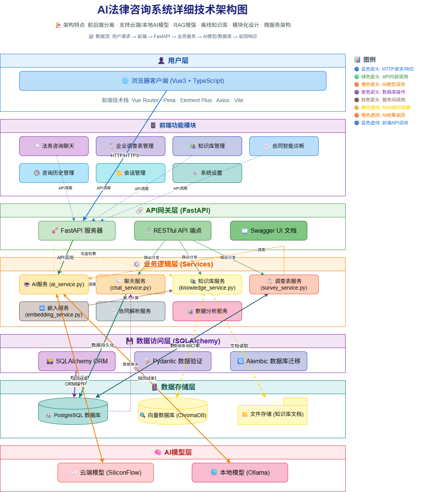
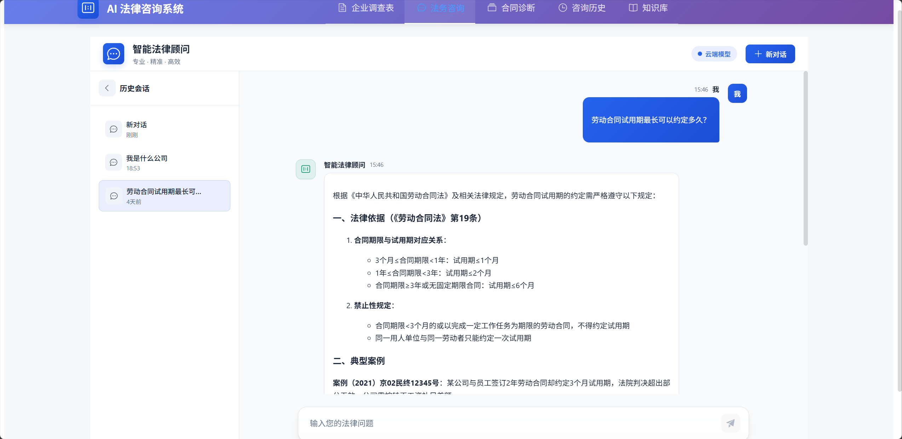
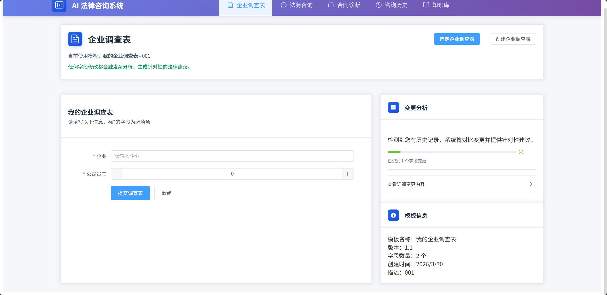
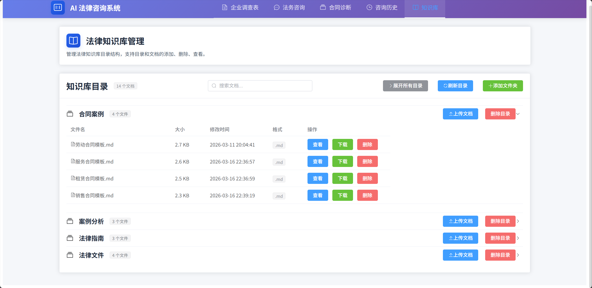
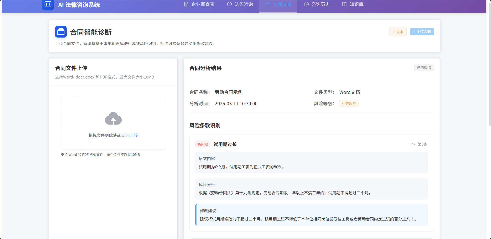
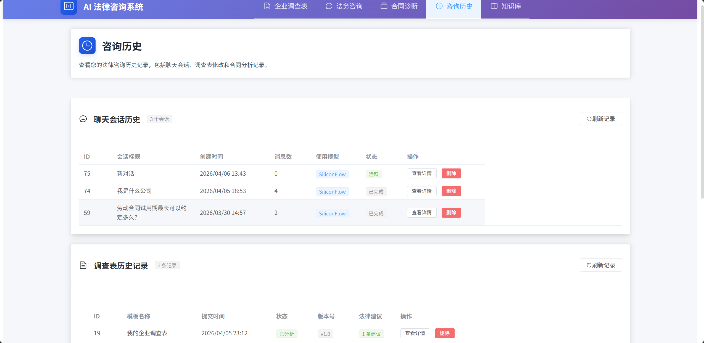

# 📋 AI 法律咨询系统

基于FastAPI + Vue3 + PostgreSQL构建的AI法律咨询系统。

## 🎯 项目概述

**AI 法律咨询系统**是一个面向企业的智能法律服务平台，通过 AI 大模型技术结合专业法律知识库，为企业提供实时法律咨询、个性化调查、合同风险诊断一站式法律服务。系统采用前后端分离架构，支持云端与本地 AI 模型，确保数据安全与响应效率。

### 技术栈

- **后端**: FastAPI + SQLAlchemy + PostgreSQL
- **前端**: Vue3 + TypeScript + Element Plus + Pinia + Vue Router
- **AI模型**: SiliconFlow（云端）、Ollama（本地）
- **数据库**: PostgreSQL
- **部署**: Docker（计划中）

## 🏗️ 系统架构

### 技术架构图

系统采用分层架构设计，前后端分离，支持云端与本地AI模型混合部署，采用RAG增强技术：

<div align="center">
  
  <br>
  <em>图：AI法律咨询系统详细技术架构</em>
</div>

## 🏗️ 功能模块

### 1. 法务咨询聊天功能（已完成）
- 支持多轮对话，可切换LLM提供商（SiliconFlow/Ollama）
- 对话历史保存在数据库
- 支持清空对话、重新生成回答
- RAG增强：LLM自动结合最新调查表内容+历史聊天记录+知识库语义向量+用户问题综合回答，实现个性化法律咨询

<div align="center">
  
  <br>
  <em>图：法务咨询聊天界面</em>
</div>

### 2. 企业调查表功能（已完成）
- 用户设置选项的调查表单（单选/多选/填空混合）
- 用户填写/修改企业信息后保存
- **关键逻辑**：任何字段修改 → 触发LLM分析变更 → 生成针对性法律建议
- 支持查看历史修改记录和建议

<div align="center">
  
  <br>
  <em>图：企业调查表界面</em>
</div>

### 3. 知识库管理功能（已完成）
- 基于 `backend/knowledge_base/` 目录的离线知识库系统
- 向量化存储支持语义检索
- 支持文档上传、分类管理
- 与聊天功能深度集成，提供精准法律知识检索

<div align="center">
  
  <br>
  <em>图：知识库管理界面</em>
</div>

### 4. 合同智能诊断功能（开发中）
- 支持拖拽上传Word文件
- 后端解析合同文本（python-docx）
- 基于本地知识库进行离线风险识别
- 标注风险条款并给出修改建议
- 知识库完全离线运行，不依赖外部API（可使用本地Ollama模型）

<div align="center">
  
  <br>
  <em>图：合同智能诊断界面</em>
</div>

### 5. 咨询历史管理（已完成）
- 完整记录企业调查表的历史修改记录
- 保存每次LLM生成的法律建议和分析报告
- 提供数据分析和趋势报告功能

<div align="center">
  
  <br>
  <em>图：咨询历史管理界面</em>
</div>

## 🚀 快速开始

### 环境要求
- Python 3.9+
- Node.js 16+
- PostgreSQL 12+
- Git

### 1. 克隆项目
```bash
git clone <https://github.com/doorofnight/Legal_consultation_system.git>
cd Legal_consultation_system
```

### 2. 环境变量配置
将 `backend/.env.example` 文件修改为`backend/.env`，配置以下内容：

**数据库配置**：
```env
POSTGRES_HOST="localhost"
POSTGRES_PORT=5432
POSTGRES_USER="postgres"
POSTGRES_PASSWORD="123456"
POSTGRES_DATABASE="legal_consultation"
```

**AI模型配置**：
```env
# 默认模型提供商
DEFAULT_MODEL_PROVIDER="siliconflow"  # siliconflow, ollama

# 嵌入模型提供商
EMBEDDING_MODEL_PROVIDER="siliconflow"  # siliconflow, ollama

# SiliconFlow配置（云端模型）
SILICONFLOW_API_KEY="your_api_key_here"
SILICONFLOW_BASE_URL="https://api.siliconflow.cn/v1"
SILICONFLOW_MODEL="deepseek-ai/DeepSeek-V3"
SILICONFLOW_EMBEDDING_MODEL="Qwen/Qwen3-Embedding-8B"

# Ollama配置（本地模型）
OLLAMA_BASE_URL="http://localhost:11434"
OLLAMA_MODEL="deepseek-r1:1.5b"
OLLAMA_EMBEDDING_MODEL="qwen3-embedding:0.6b"
```

### 3. 后端部署

#### 方式1：使用脚本启动 (Windows，推荐)
```bash
cd backend
start.bat
```

#### 方式2：手动启动
```bash
cd backend

# 1. 检查Python环境（可选）
python --version

# 2. 创建虚拟环境（如果不存在）
python -m venv venv

# 3. 激活虚拟环境
venv\Scripts\activate  # Windows
# source venv/bin/activate  # Linux/Mac

# 4. 升级pip并安装依赖
pip install --upgrade pip
pip install -r requirements.txt -i https://mirrors.aliyun.com/pypi/simple/

# 5. 初始化数据库表（需要PostgreSQL服务已启动）
python -c "from app.db.session import engine; from app.db.base import Base; Base.metadata.create_all(bind=engine); print('数据库表创建完成')"

# 6. 启动后端服务
uvicorn app.main:app --host 0.0.0.0 --port 8000 --reload
```

### 4. 前端部署
```bash
cd frontend
npm install
npm run dev
```

## 📈 开发进度

### 已完成功能
- [x] 项目基础目录结构
- [x] 后端环境配置(.env)
- [x] 数据库模型设计(SQLAlchemy)
- [x] FastAPI应用基础框架
- [x] Vue3前端基础框架
- [x] 基础路由和页面布局
- [x] 聊天功能API实现
- [x] AI服务集成（SiliconFlow/Ollama）
- [x] 前端聊天界面
- [x] 会话管理功能
- [x] 企业调查表功能
- [x] 知识库管理系统
- [x] 咨询历史管理

### 待完成功能
- [ ] 合同智能诊断功能
- [ ] 文件上传服务
- [ ] 文档解析服务
- [ ] 风险条款识别算法
- [ ] 前端合同上传组件
- [ ] 风险分析结果展示

## 📚 项目文档

系统提供完整的文档支持，分为以下专门指南：

1. **`README.md`** - 项目主文档，包含项目概述、快速开始、功能说明等核心信息
2. **`API接口文档.md`** - 详细的API接口说明，包含所有端点、参数、请求示例和响应格式
3. **`文件目录文档.md`** - 完整的项目目录结构说明，详细解释每个文件和目录的作用
4. **`本地模型下载指南.md`** - 本地Ollama模型下载、安装和配置指南
5. **`模型参数修改指南.md`** - 模型参数优化建议和配置说明
6. **`知识库使用指南（必看）.md`** - 知识库向量化、文档添加和使用方法指南

## 📄 许可证

本项目采用 MIT 许可证。详情请见 [LICENSE](LICENSE) 文件。
